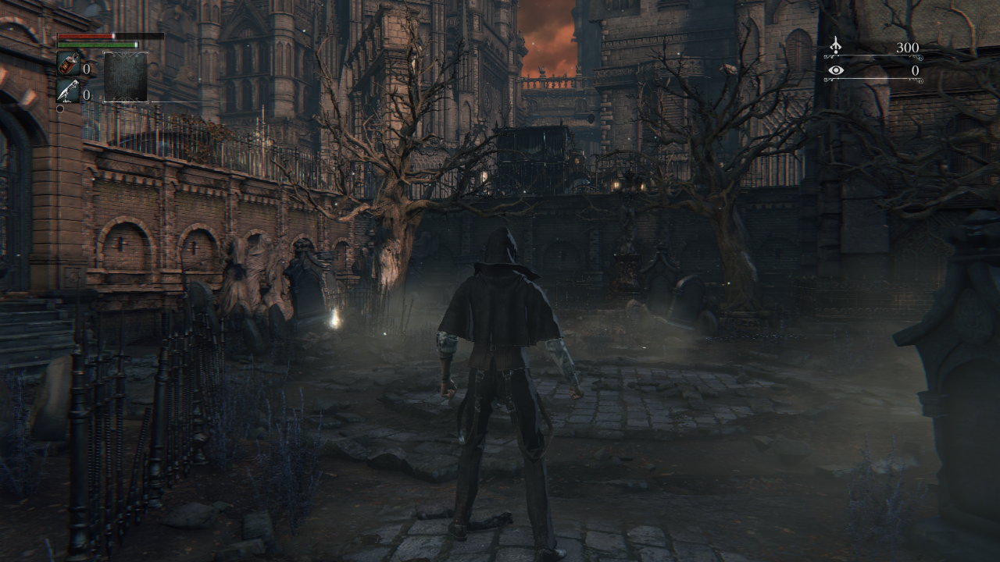
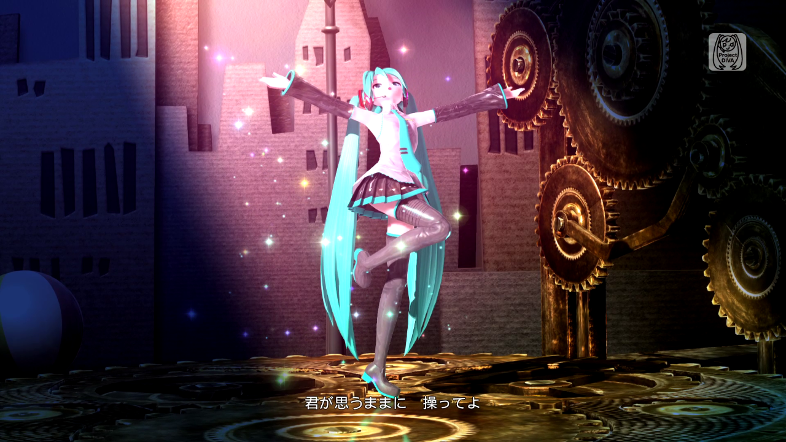
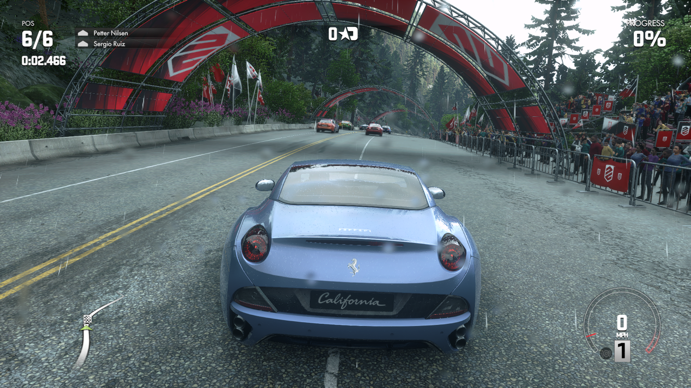

<!--
SPDX-FileCopyrightText: 2024 shadPS4 Emulator Project
SPDX-License-Identifier: GPL-2.0-or-later
-->

<h1 align="center">
  <br>
  <a href="https://shadps4.net/"></a>
  <br>
  <b>shadPS4</b>
  <br>
</h1>

<h1 align="center">
 <a href="https://discord.gg/bFJxfftGW6">
        
 <a href="https://github.com/shadps4-emu/shadPS4/releases/latest">
        
 <a href="https://shadps4.net/">
        
 <a href="https://x.com/shadps4">
        
 <a href="https://github.com/shadps4-emu/shadPS4/stargazers">
        
</h1>

|               Bloodborne by From Software                   |                     Hatsune Miku Project DIVA Future Tone by SEGA                         |
| :-----------------------------------------------------------: | :--------------------------------------------------------------------------------------------: |
|  |  |

|                  Yakuza 0 by SEGA                     |                 DRIVECLUB™ by Evolution Studios                    |
| :------------------------------------------------------------------------: | :------------------------------------------------------------------: |
|  |  |

# General information

**shadPS4** is an early **PlayStation 4** emulator for **Windows**, **Linux** and **macOS** written in C++.

> [!IMPORTANT]
> This is the emulator core, which does not include a GUI. If you just want to use the emulator as an end user, download the [**QtLauncher**](https://github.com/shadps4-emu/shadps4-qtlauncher/releases) instead.

If you encounter problems or have doubts, do not hesitate to look at the [**Quickstart**](https://github.com/shadps4-emu/shadPS4/wiki/I.-Quick-start-%5BUsers%5D).\
To verify that a game works, you can look at [**shadPS4 Game Compatibility**](https://github.com/shadps4-compatibility/shadps4-game-compatibility).\
To discuss shadPS4 development, suggest ideas or to ask for help, join our [**Discord server**](https://discord.gg/bFJxfftGW6).\
To get the latest news, go to our [**X (Twitter)**](https://x.com/shadps4) or our [**website**](https://shadps4.net/).\
You can donate to the project via our [**Kofi page**](https://ko-fi.com/shadps4).

# Status

> [!IMPORTANT]
> shadPS4 is early in development, don't expect a flawless experience.

Currently, the emulator can successfully run games like [**Bloodborne**](https://www.youtube.com/watch?v=5sZgWyVflFM), [**Dark Souls Remastered**](https://www.youtube.com/watch?v=-3PA-Xwszts), [**Red Dead Redemption**](https://www.youtube.com/watch?v=Al7yz_5nLag), and many other games.

# Why

This project began for fun. Given our limited free time, it may take some time before shadPS4 can run more complex games, but we're committed to making small, regular updates.

# Building

## Windows

Check the build instructions for [**Windows**](https://github.com/shadps4-emu/shadPS4/blob/main/documents/building-windows.md).

## Linux

Check the build instructions for [**Linux**](https://github.com/shadps4-emu/shadPS4/blob/main/documents/building-linux.md).

## macOS

Check the build instructions for [**macOS**](https://github.com/shadps4-emu/shadPS4/blob/main/documents/building-macos.md).

> [!IMPORTANT]
> macOS users need at least macOS 15.4 to run shadPS4. Due to GPU issues there are currently heavy bugs on Intel Macs.

# Usage examples

> [!IMPORTANT]
> For a user-friendly GUI, download the [**QtLauncher**](https://github.com/shadps4-emu/shadps4-qtlauncher/releases).

To get the list of all available commands and also a more detailed description of what each command does, please refer to the `--help` flag's output.

Below is a list of commonly used command patterns:
```sh
shadPS4 CUSA00001 # Searches for a game folder called CUSA00001 in the list of game install folders, and boots it.
shadPS4 --fullscreen true --config-clean CUSA00001    # the game argument is always the last one,
shadPS4 -g CUSA00001 --fullscreen true --config-clean # ...unless manually specified otherwise.
shadPS4 /path/to/game.elf # Boots a PS4 ELF file directly. Useful if you want to boot an executable that is not named eboot.bin.
shadPS4 CUSA00001 -- -flag1 -flag2 # Passes '-flag1' and '-flag2' to the game executable in argv.
```

# Debugging and reporting issues

For more information on how to test, debug and report issues with the emulator or games, read the [**Debugging documentation**](https://github.com/shadps4-emu/shadPS4/blob/main/documents/Debugging/Debugging.md).

# Keyboard and Mouse Mappings

> [!NOTE]
> Some keyboards may also require you to hold the Fn key to use the F\* keys. Mac users should use the Command key instead of Control, and need to use Command+F11 for full screen to avoid conflicting with system key bindings.

| Button | Function |
|-------------|-------------|
F10 | FPS Counter
Ctrl+F10 | Video Debug Info
F11 | Fullscreen
F12 | Trigger RenderDoc Capture

> [!NOTE]
> Xbox and DualShock controllers work out of the box.

| Controller button | Keyboard equivalent |
|-------------|-------------|
LEFT AXIS UP | W |
LEFT AXIS DOWN | S |
LEFT AXIS LEFT | A |
LEFT AXIS RIGHT | D |
RIGHT AXIS UP | I |
RIGHT AXIS DOWN | K |
RIGHT AXIS LEFT | J |
RIGHT AXIS RIGHT | L |
TRIANGLE | Numpad 8 or C |
CIRCLE | Numpad 6 or B |
CROSS | Numpad 2 or N |
SQUARE | Numpad 4 or V |
PAD UP | UP |
PAD DOWN | DOWN |
PAD LEFT | LEFT |
PAD RIGHT | RIGHT |
OPTIONS | RETURN |
BACK BUTTON / TOUCH PAD | SPACE |
L1 | Q |
R1 | U |
L2 | E |
R2 | O |
L3 | X |
R3 | M |

Keyboard and mouse inputs can be customized in the settings menu by clicking the Controller button, and further details and help on controls are  also found there. Custom bindings are saved per-game. Inputs support up to three keys per binding, mouse buttons, mouse movement mapped to joystick input, and more.


# Firmware files

shadPS4 can load some PlayStation 4 firmware files.
The following firmware modules are supported and must be placed in shadPS4's `sys_modules` folder.

<div align="center">

| Modules                 | Modules                 | Modules                 | Modules                 |  
|-------------------------|-------------------------|-------------------------|-------------------------|  
| libSceCesCs.sprx        | libSceFont.sprx         | libSceFontFt.sprx       | libSceFreeTypeOt.sprx   |
| libSceJpegDec.sprx      | libSceJpegEnc.sprx      | libSceJson.sprx         | libSceJson2.sprx        |  
| libSceLibcInternal.sprx | libSceNgs2.sprx         | libScePngEnc.sprx       | libSceRtc.sprx          |
| libSceUlt.sprx          | libSceAudiodec.sprx     |                         |                         |
</div>

> [!Caution]
> The above modules are required to run the games properly and must be dumped from your legally owned PlayStation 4 console.


# Main team

- [**georgemoralis**](https://github.com/georgemoralis)
- [**psucien**](https://github.com/psucien)
- [**viniciuslrangel**](https://github.com/viniciuslrangel)
- [**roamic**](https://github.com/roamic)
- [**squidbus**](https://github.com/squidbus)
- [**frodo**](https://github.com/baggins183)
- [**Stephen Miller**](https://github.com/StevenMiller123)
- [**kalaposfos13**](https://github.com/kalaposfos13)

Logo is done by [**Xphalnos**](https://github.com/Xphalnos)

# Contributing

If you want to contribute, please read the [**CONTRIBUTING.md**](https://github.com/shadps4-emu/shadPS4/blob/main/CONTRIBUTING.md) file.\
Open a PR and we'll check it :)


# Special Thanks

A few noteworthy teams/projects who've helped us along the way are:

- [**Panda3DS**](https://github.com/wheremyfoodat/Panda3DS): A multiplatform 3DS emulator from our co-author wheremyfoodat. They have been incredibly helpful in understanding and solving problems that came up from natively executing the x64 code of PS4 binaries

- [**fpPS4**](https://github.com/red-prig/fpPS4): The fpPS4 team has assisted massively with understanding some of the more complex parts of the PS4 operating system and libraries, by helping with reverse engineering work and research.

- **yuzu**: Our shader compiler has been designed with yuzu's Hades compiler as a blueprint. This allowed us to focus on the challenges of emulating a modern AMD GPU while having a high-quality optimizing shader compiler implementation as a base.

- [**felix86**](https://github.com/OFFTKP/felix86): A new x86-64 → RISC-V Linux userspace emulator

# License

- [**GPL-2.0 license**](https://github.com/shadps4-emu/shadPS4/blob/main/LICENSE)
